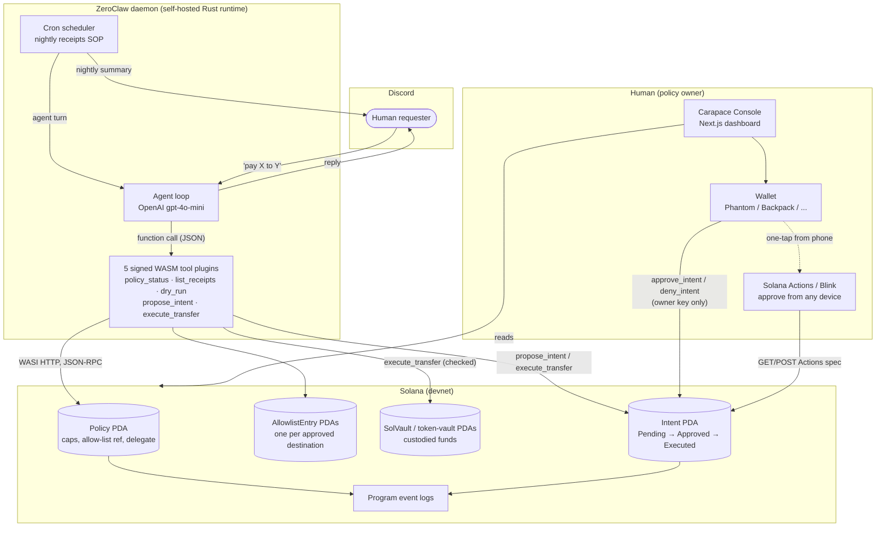

# Carapace

**On-chain enforced spending guardrails for autonomous [ZeroClaw](https://github.com/zeroclaw-labs/zeroclaw) agents.**

Built for Superteam Brasil's ["Build Solana-native plugins for ZeroClaw"](https://superteam.fun/earn/listing/zeroclaw) bounty.

## Overview

ZeroClaw already ships real security primitives for autonomous agents — autonomy
levels, an approval-gate system, cryptographic tool receipts — but all of it is
enforced and stored **locally, on the agent's own host**. A compromised host or a
jailbroken prompt can forge a receipt, rubber-stamp its own approval gate, or
ignore an in-process spend limit, because nothing *outside* that machine is
checking it.

Carapace makes Solana that external trust anchor. An agent's operating funds live
in a program-owned vault it cannot independently move; every transfer is checked,
atomically, by the Solana runtime itself against a per-transaction cap, a daily
cap, a destination allow-list, and — above a configurable threshold — a
human-approved on-chain `Intent`. The agent holds a session key that can *ask* the
program to move funds; whether that ask succeeds is decided entirely by code a
compromised host cannot talk its way around.

This isn't a design document. A real ZeroClaw daemon, built from source, runs a
real agent on a real Discord server, backed by a real Anchor program on Solana
devnet — see [`docs/SHOWCASE.md`](docs/SHOWCASE.md) for every transaction
signature.

## Features

- **Program-owned custody** — funds sit in `SolVault`/token-vault PDAs, never in
  a wallet the agent's delegate key independently controls.
- **Per-transaction and daily spending caps**, enforced on-chain, per asset (SOL
  and one configured SPL mint per policy).
- **Destination allow-list**, enforced structurally by account constraints — a
  transfer to an unlisted address is rejected before the instruction handler
  even runs.
- **Human-approval gate above a threshold**, via an `Intent` PDA the program
  checks field-for-field (asset, amount, destination) against the transfer
  being executed, single-use and replay-proof.
- **Five signed WASM Component Model plugins** targeting ZeroClaw's own
  experimental `tool-plugin` interface: check policy status, list receipts
  (plus recent failures and pending intents), dry-run a transfer with no state
  change, propose an above-threshold intent, execute a transfer.
- **Plain-language refusals** — a failed transfer's on-chain error is decoded
  into a fixed, human-readable sentence instead of raw JSON-RPC output.
- **A nightly Discord summary** (ZeroClaw cron SOP) of what moved, what's
  pending, and what was refused.
- **Carapace Console** — a Next.js dashboard to view live policy state, approve
  or deny pending Intents, manage the allow-list/limits/vault/delegate, and
  create a brand-new policy entirely from the browser.
- **Solana Actions (Blinks)** — approve a pending Intent from any Blink-aware
  wallet, on any device, in one tap.

## Architecture



The two halves never share a key. The agent's `delegate` key can only ever ask
the program to move funds; the `owner` key — which the agent never holds — is
the only key that can approve an above-threshold `Intent`, change limits, or
withdraw. A full request-lifecycle walkthrough (propose → notify → approve →
execute → verify) lives in [`docs/ARCHITECTURE.md`](docs/ARCHITECTURE.md); the
threat model and every on-chain constraint is in
[`docs/SECURITY.md`](docs/SECURITY.md).

## Tech stack

| Layer | Technology |
|---|---|
| On-chain program | [Anchor](https://www.anchor-lang.com/) (Rust), Solana devnet |
| Shared Solana primitives | Hand-rolled Rust crate (`solana-core`) — no `solana-sdk`/`solana-client` dependency, portable to `wasm32-wasip2`, cross-checked byte-for-byte against `solana-sdk` in its own test suite |
| Agent tool plugins | Rust, compiled to WebAssembly Component Model (`wasm32-wasip2`) via `cargo-component`, against ZeroClaw's `zeroclaw:plugin@0.1.0` `tool-plugin` world |
| Agent runtime | [ZeroClaw](https://github.com/zeroclaw-labs/zeroclaw) (built from source), OpenAI `gpt-4o-mini`, Discord channel |
| Dashboard | Next.js 16 (App Router), React 19, TypeScript, Tailwind CSS v4, `@solana/web3.js`, `@coral-xyz/anchor`, `@solana/wallet-adapter-react`, Framer Motion, Recharts |
| Human approval | Solana Actions (Blinks), any Wallet-Standard-compliant wallet |

## Project structure

A Rust/Anchor monorepo with one Next.js app, not a traditional web-app
backend/frontend split — Solana itself is the source of truth (no separate
database), and the only "backend" beyond the chain is the self-hosted ZeroClaw
daemon and two lightweight Next.js Route Handlers for Blinks.

```
programs/carapace/   On-chain Anchor program
plugins/              solana-core crate + the 5 WASM tool plugins + signed bundle
apps/console/         Next.js dashboard + Blinks API routes
demo/                 Real ZeroClaw config running the live Discord demo
docs/                 Architecture, security model, setup, showcase write-up
spikes/                Day-0 feasibility spikes (signing, WASI HTTP, plugin host)
scripts/               Plugin manifest signing tool
```

## Installation

Prerequisites: Rust + `wasm32-wasip2` target, [Solana CLI](https://docs.anza.xyz/cli/install),
Anchor CLI, Node.js 20+. Full toolchain commands in
[`docs/SETUP.md`](docs/SETUP.md#1-toolchain-one-time).

```bash
git clone <this-repo>
cd forge

# Anchor program + its TypeScript test suite
cd programs/carapace && npm install && cd ../..

# Dashboard
cd apps/console && npm install && cd ../..
```

## Environment variables

**`apps/console`** — all optional, sensible defaults are baked in. Set in
`apps/console/.env.local` to point at your own RPC provider (public endpoints
are rate-limited):

| Variable | Default |
|---|---|
| `NEXT_PUBLIC_CARAPACE_PROGRAM_ID` | `GuZ6yoSDkTcYh2PKAeoDdb51ZhP9i7pRhL6MGrZXST8L` |
| `NEXT_PUBLIC_DEVNET_RPC_URL` | `https://api.devnet.solana.com` |
| `NEXT_PUBLIC_MAINNET_RPC_URL` | `https://api.mainnet-beta.solana.com` |
| `NEXT_PUBLIC_LOCALNET_RPC_URL` | `http://127.0.0.1:8899` |
| `NEXT_PUBLIC_DEFAULT_CLUSTER` | `devnet` |

Full table, including what to do if you deploy your own program instance, in
[`apps/console/README.md`](apps/console/README.md#environment-variables).

**The live ZeroClaw demo** (`demo/`) reads secrets from a gitignored
`.secrets/demo-credentials.env` (`OPENAI_API_KEY`, `DISCORD_BOT_TOKEN`,
`CARAPACE_DELEGATE_SECRET_KEY`) — see [`demo/README.md`](demo/README.md).

## Running locally

**Anchor program**, against a local validator, no devnet funds needed:

```bash
cd programs/carapace
anchor test
```

**Dashboard:**

```bash
cd apps/console
npm run dev   # http://localhost:3000
```

**The live agent** (requires your own OpenAI key + Discord bot token):

```bash
./demo/quickstart.sh   # one-time: creates your own on-chain policy
~/.carapace-zeroclaw/run.sh
```

## Build & deployment

**Dashboard** — a standard Next.js app (App Router, mostly client components
plus two Route Handlers), deployable anywhere Next.js runs:

```bash
cd apps/console
npm run build
npm run start
```

**Anchor program** — devnet deployment steps (toolchain, wallet funding,
`anchor deploy`) are in
[`docs/SETUP.md`](docs/SETUP.md#4-devnet-deployment-real-judge-visible-deployment).
The program already deployed for this submission is
[`GuZ6yoSDkTcYh2PKAeoDdb51ZhP9i7pRhL6MGrZXST8L`](https://solscan.io/account/GuZ6yoSDkTcYh2PKAeoDdb51ZhP9i7pRhL6MGrZXST8L?cluster=devnet)
on devnet — a new policy under it (for your own wallet) needs no redeploy, see
[`demo/quickstart.sh`](demo/quickstart.sh).

## Showcase

No screenshots are checked into the repo (the dashboard is best seen live —
`npm run dev` and connect a devnet wallet). What exists instead is stronger
proof: [`docs/SHOWCASE.md`](docs/SHOWCASE.md) walks through three live tests
against the real deployed system — a below-threshold auto-executed transfer, an
above-threshold transfer that correctly required the owner's on-chain approval,
and a prompt-injection attempt that was refused before touching the chain at
all — with every transaction signature linked on Solscan.

## API overview

`apps/console` ships two Route Handlers implementing the
[Solana Actions](https://docs.solanamobile.com/react-native/actions) spec, so
any Blink-aware wallet can approve a pending Intent without opening the
dashboard:

| Route | Method | Does |
|---|---|---|
| `/api/actions/intent/[intentAddress]` | `GET` | Returns the Blink metadata (icon, title, description, action buttons) for a pending Intent. |
| `/api/actions/intent/[intentAddress]` | `POST` | Given `{"account": "<pubkey>"}`, returns an **unsigned** `approve_intent`/`deny_intent` transaction for that wallet to sign — the route never holds a key of its own. |

Full details, including how to actually test a Blink (needs an HTTPS origin —
`localhost` won't work from a wallet's in-app browser), in
[`apps/console/README.md`](apps/console/README.md#the-blinks-endpoint).

## Folder structure

```
forge/
├── programs/carapace/            Anchor program
│   ├── programs/carapace/src/    Policy/Intent/AllowlistEntry state, instructions
│   ├── tests/                    Anchor/TypeScript test suite (12/12 passing)
│   └── manual/                   One-off scripts: init a policy, approve an
│                                  intent, rotate the delegate, allow-list an
│                                  address, halve the daily cap, ...
├── plugins/
│   ├── solana-core/               Shared Rust crate: signing, PDA derivation,
│   │                              tx building, JSON-RPC shapes, dry-run
│   │                              evaluation logic, error translation
│   ├── carapace_policy_status/    Tool: read caps/allowance/pause state
│   ├── carapace_list_receipts/    Tool: decoded audit trail + failures + pending intents
│   ├── carapace_dry_run/          Tool: "would this succeed?" with no state change
│   ├── carapace_propose_intent/   Tool: sign + submit an above-threshold Intent
│   ├── carapace_execute_transfer/ Tool: sign + submit a transfer
│   └── bundle/                    Assembled, Ed25519-signed, installable output
├── apps/console/                 Next.js dashboard
│   └── src/
│       ├── app/                  Pages, layout, Blinks API routes
│       ├── components/           UI primitives, dashboard panels, providers
│       ├── hooks/                On-chain read/write hooks
│       └── lib/carapace/         Program client, PDA helpers, IDL
├── demo/                         Live ZeroClaw + Discord demo config
├── docs/                         Architecture, security, setup, showcase, exploit analysis
├── spikes/                       Day-0 feasibility spikes
└── scripts/sign-plugin-manifest/ Ed25519 plugin manifest signer
```

## Contributing

This is a bounty submission, not (yet) an actively maintained open-source
project — but issues and PRs are welcome. Before opening one:

- Run `anchor test` (program changes) and `npm run build` +
  `npx tsc --noEmit` (dashboard changes) — both should be clean.
- Match the existing code's habit of explaining *why*, not *what*, in
  comments — see any file in `programs/carapace/programs/carapace/src/` for
  the tone.
- Security-relevant changes to `programs/carapace` should update
  [`docs/SECURITY.md`](docs/SECURITY.md) in the same change, not as a
  follow-up.

## License

Dual-licensed under MIT or Apache-2.0, matching ZeroClaw's own licensing. See
[`LICENSE-MIT`](LICENSE-MIT) and [`LICENSE-APACHE`](LICENSE-APACHE).
