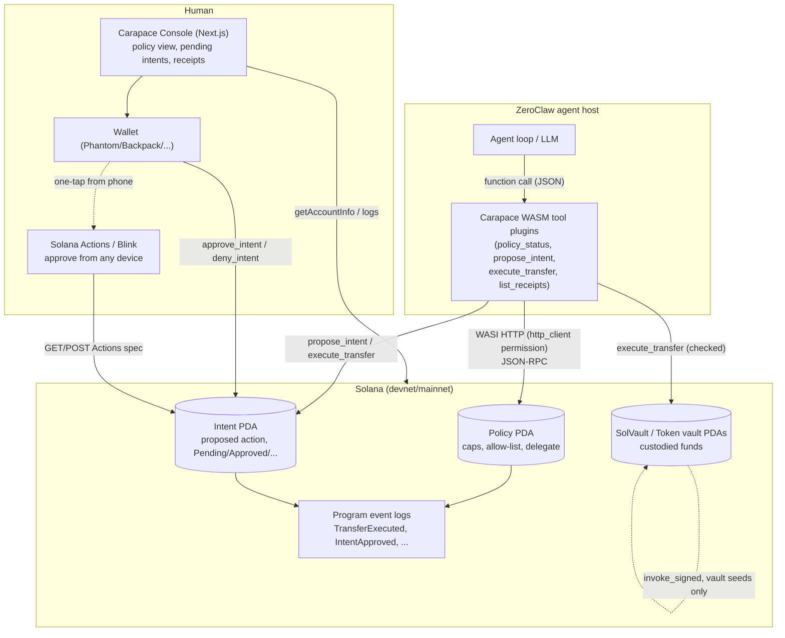

# Architecture

## Components

## Request lifecycle: an agent proposes a payment, a human approves it, the agent executes it

1. **Agent decides to act.** The ZeroClaw agent loop, reasoning over a task
   ("pay this invoice"), calls the `carapace_policy_status` tool to check
   current caps/remaining allowance, then decides an amount that requires
   approval (`amount >= policy.approval_threshold_*`).
2. **Agent proposes an Intent.** The `carapace_propose_intent` WASM tool
   plugin builds a `propose_intent` instruction (asset, amount, destination,
   a hash of the human-readable description), signs it with the agent's
   session key (loaded from ZeroClaw's per-plugin config via the
   `config_read` permission), and submits it over WASI HTTP
   (`http_client` permission) to a Solana RPC endpoint. The program creates
   an `Intent` PDA with `status = Pending`.
3. **Human is notified.** Whatever ZeroClaw channel the operator uses
   (Discord, Telegram, email) carries the agent's own message describing the
   pending action, plus a link: either to the Carapace Console's pending-
   intents view, or directly to a Solana Actions (Blink) URL for that
   specific `Intent`.
4. **Human approves — from anywhere.** Opening the Blink in any Blink-aware
   wallet (or connecting a wallet in the Console) builds and signs an
   `approve_intent` transaction. This requires the `owner` key specifically —
   the agent's `delegate` key cannot approve its own request. The Intent
   flips to `Approved` on chain.
5. **Agent executes.** The `carapace_execute_transfer` tool plugin builds
   `execute_transfer_sol`/`execute_transfer_spl`, referencing the now-
   `Approved` Intent. The program re-checks every field (asset, amount,
   destination) against the Intent, the per-tx cap, the daily cap, and the
   allow-list — all in the same instruction, atomically — then moves funds
   out of the program-owned vault via `invoke_signed` and marks the Intent
   `Executed` (single-use, replay-proof).
6. **Anyone can verify, independently of the operator's machine.** The
   `TransferExecuted` event in that transaction's logs — plus the on-chain
   `Policy`/`Intent` state — is enough for a third party (an auditor, a
   counterparty, the human themselves from a different device) to confirm
   the action happened, when, for how much, and that it was within the
   policy's own declared bounds, without trusting anything the agent's host
   reports locally.

## Why each piece exists (nothing decorative)

- **Anchor program**: the actual trust boundary. Everything upstream of it
  (the agent, the plugin, the LLM) is explicitly untrusted — the program is
  what a compromised host cannot talk its way around.
- **WASM tool plugins (`wit/v0/tool.wit`)**: ZeroClaw's own native,
  experimental plugin architecture, not a generic MCP shim — chosen because
  the bounty is specifically about Solana-native *plugins for ZeroClaw*, and
  because the sandboxing (no filesystem/network beyond explicitly granted
  permissions) is itself a security property worth using, not just a
  packaging format.
- **Next.js Console + Blinks**: the human-approval loop is only as good as
  its worst-case latency. A human who has to SSH into the ZeroClaw host to
  approve something will not do it reliably; a Blink they can tap from a
  lock-screen notification will.
